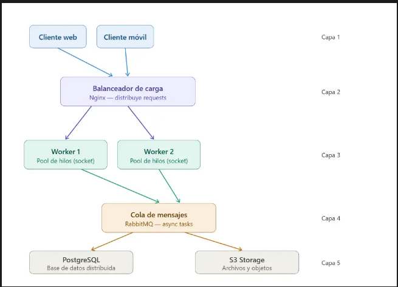

# PFO3 — Sistema Distribuido Cliente-Servidor
## Diagrama

## Archivos

- `servidor.py` — el servidor con el pool de workers y la cola de tareas
- `cliente.py` — el cliente que manda tareas y muestra los resultados

## Tecnologías usadas

- Python 3
- `socket` para la comunicación entre cliente y servidor
- `threading` para los workers en paralelo
- `queue.Queue` para la cola de tareas (simula RabbitMQ)
- `json` para los mensajes

## Cómo ejecutarlo

Primero arrancá el servidor en una terminal:
```bash
python servidor.py
```

Después en otra terminal abrís el cliente:
```bash
python cliente.py
```

Escribís cualquier tarea, el servidor la distribuye a un worker y te
devuelve el resultado. Para salir escribís `FIN`.

## Ejemplo
[Capturas de ejemplos](capturas)
```
Tarea a enviar: procesar imagen
[CLIENTE] Tarea enviada: 'procesar imagen'
  [ENCOLADA] Tarea #1 recibida y encolada
  [RESULTADO] Tarea #1 — completada por Worker 2
```